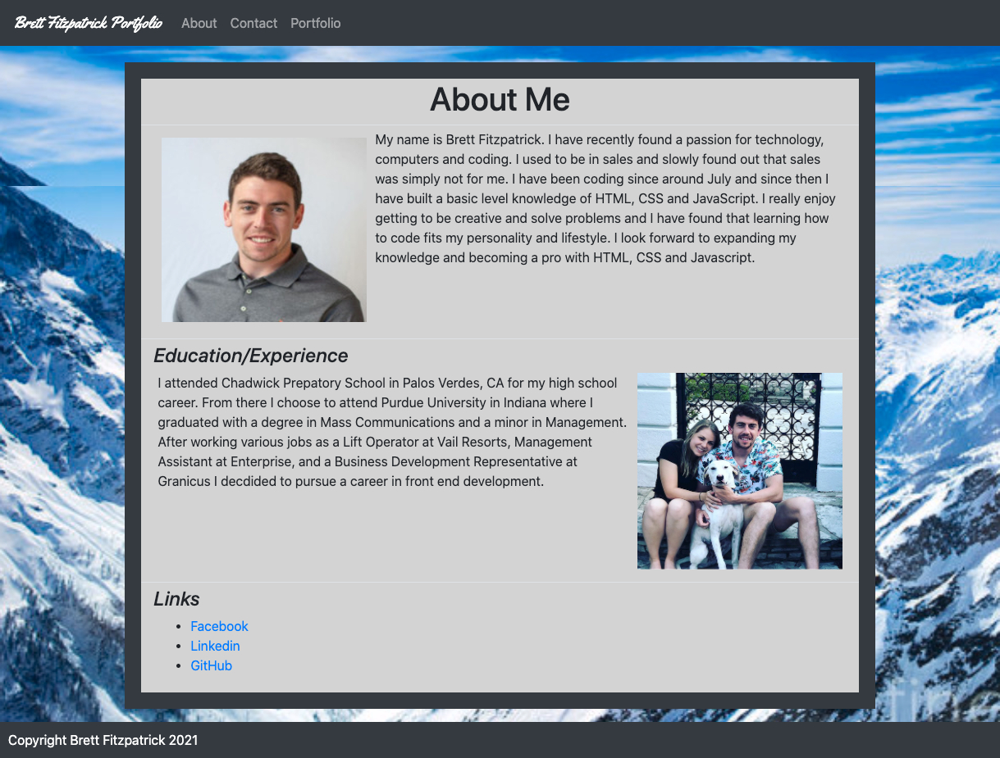
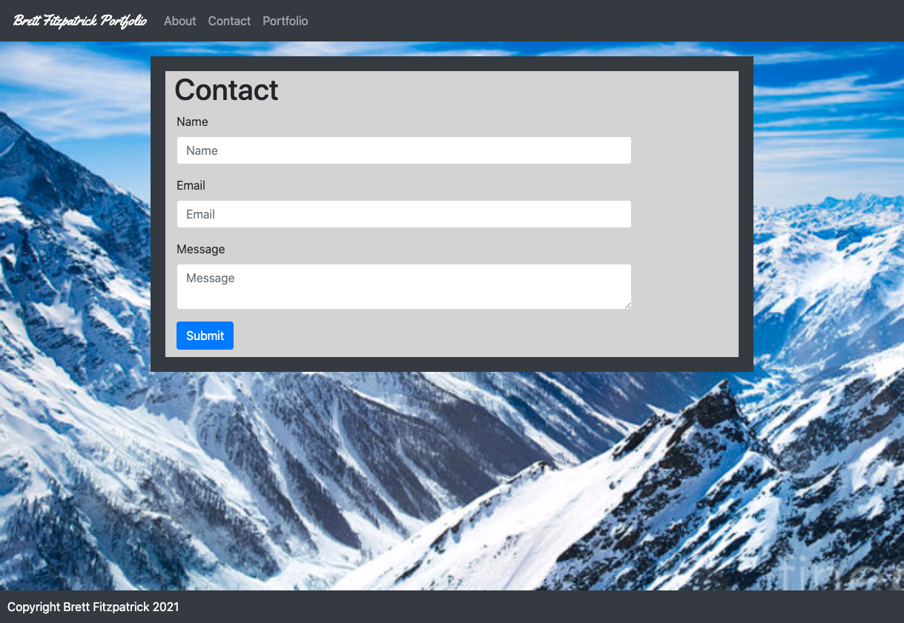
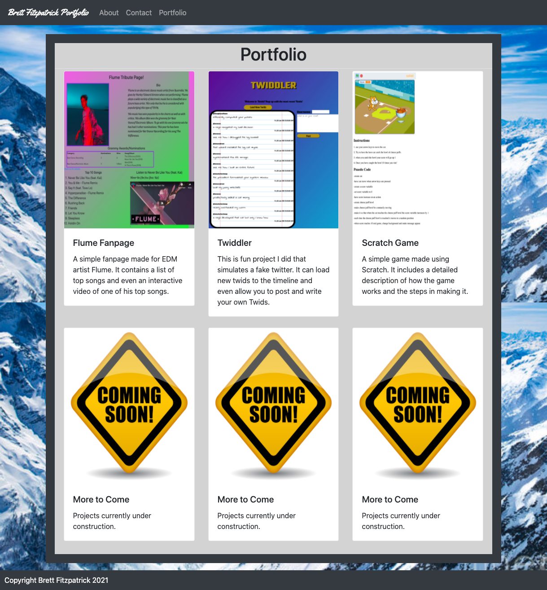

# Responsive-Portfolio
Homework 2
## Description
For this Assignment we were tasked with making a fully responsive portfolio that adjusts to all sizes. I used a fair amount of bootstrop to utilize many of the features on the site including Header and cards for the portfolio page.

There was not any javascript that went into the site as it was a pretty simple layout that didnt require any add ons. Below is screenshots of every page including a link to the live gitHub page.

[link](https://fitzpatb.github.io/Responsive-Portfolio/)

