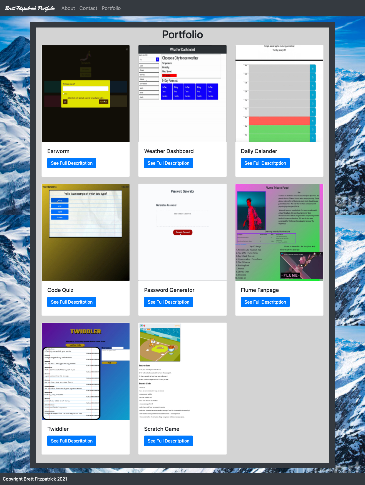

# Responsive-Portfolio
Homework 2/Updated Portfolio
## Description
For this Assignment we were tasked with making a fully responsive portfolio that adjusts to all sizes. I used a fair amount of bootstrop to utilize many of the features on the site including Header and cards for the portfolio page.

I have recently updated the portfolio page so that it dynamically generates a modal with informaiton about each project including a link to the site if it has one. Look at the updated look.

[link](https://fitzpatb.github.io/Responsive-Portfolio/)

